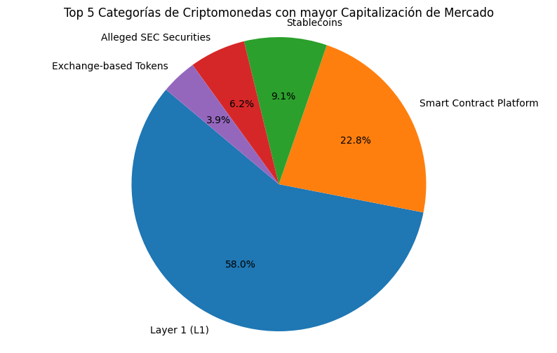
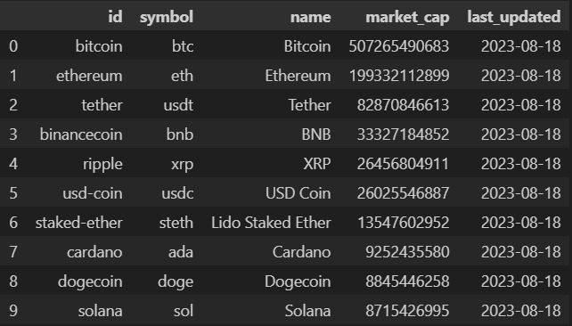
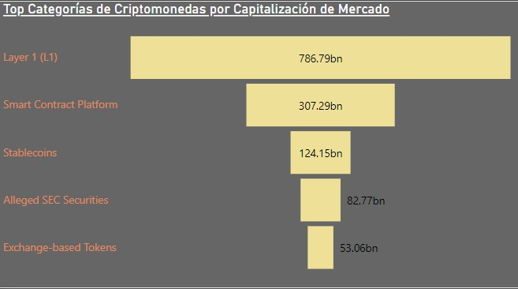
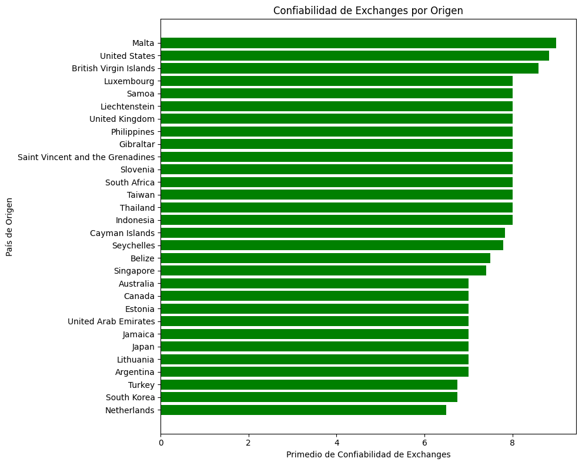
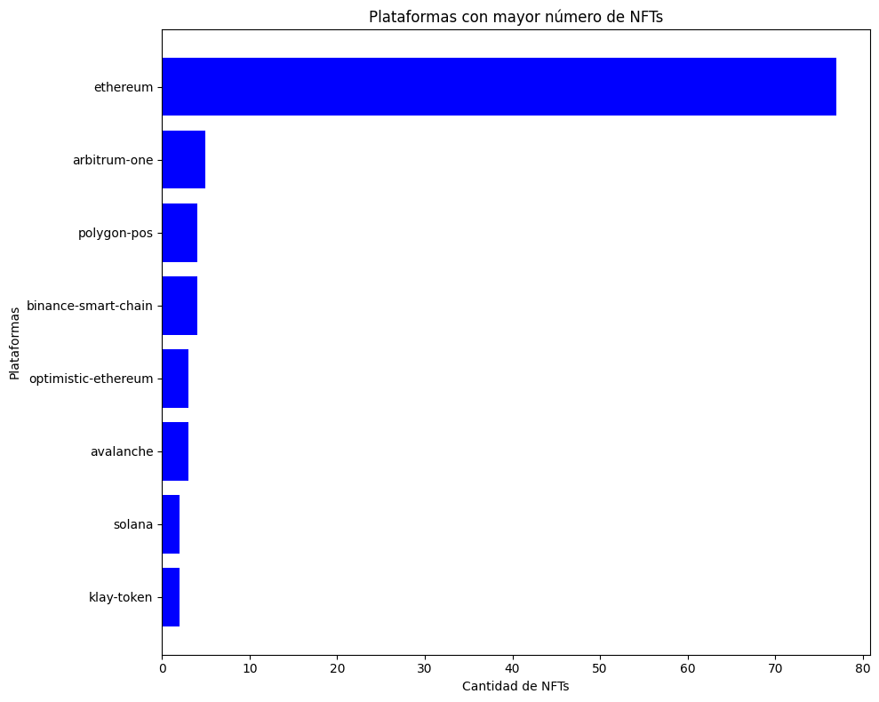
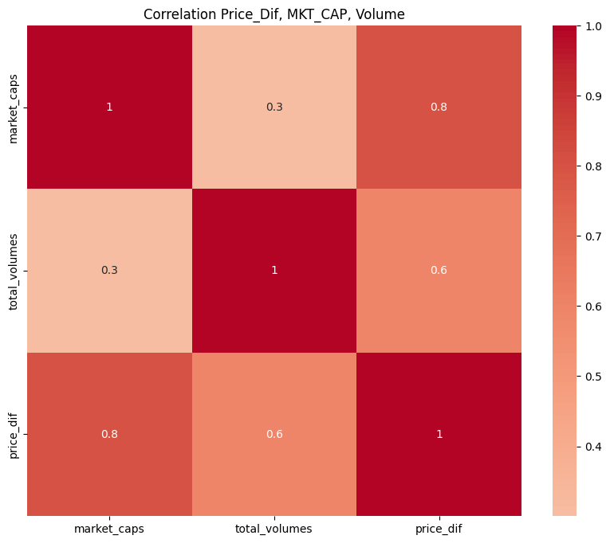
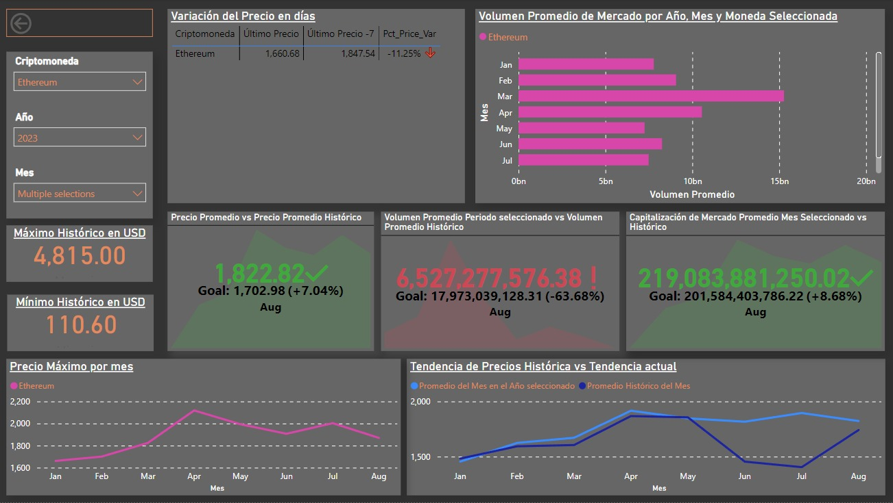

################# Proyecto PI_DA Henry-Bootcamp Nicolas Yapur ############################

# Análisis de Mercado de Criptomonedas

## Índice

- Introducción
- ETL
- EDA (Análisis Exploratorio de Datos)
- KPI' y Conclusiones
- Archivos/Links.

## Introducción

Como Data Analyst la tarea es realizar un análisis del mercado de Criptomonedas, un mercado con un crecimiento exponencial y un alto potencial de oportunidades de inversión para los clientes. En este caso se llevo acabo un análisis utilizando datos de la API CoinGecko. El objetivo es entender mejor el mercado de criptomonedas para detectar oportunidades de inversión entendiendo el riesgo y optimizando la cartera actual de la empresa.
El entregable del proyecto es el ETL realizado para obtener las fuentes de datos, el análisis EDA realizado para entender el mercado con sus respectivas conclusiones y recomendaciones y un dashboard con kpis para el seguimiento y toma de decisiones.

## ETL

La Extracción, Transformación y Carga (ETL) consistió en realizar los siguientes pasos:

- Endpoint "coin" : Extracción de datos de la API CoinGeko a traves de la función 'get_coins_list()'
- Endpoint "simple": Extracción de datos de la API CoinGeko a traves de la función 'get_supported_vs_currencies()' 
- Endpoint "asset_platforms" : Extracción de datos de la API CoinGeko a traves de la función 'get_asset_platforms()'
- Endpoint "categories" : Extracción de datos de la API CoinGeko a traves de las funciones 'get_coins_categories_list()',              'get_coins_categories()', 'get_coins_markets()' y 'get_coin_by_id()'
    - Creacion de Dataframe Fact_Coin_Categories.csv
    - Creacion de Dataframe Dim_Coin_Categories.csv
    - Creacion de Dataframe Fact_Coin_mkt_Cap.csv
    - Creacion de Dataframe Dim_Coins.csv
    - Creacion de Dataframe Fact_Coins_and_Categories.csv   
- Coins Data, creacion del Dataframe Fact_Coins.csv

## EDA

En el Análisis Exploratorio de Datos (EDA) se utilizó las funciones extridas y los archivos CSV generados en la fase de Extracción, Transformación y Carga (ETL). Con dicha información se llevó a cabo el análisis que se detalla a continuación.

    - Entendiendo Criptomonedas.
    - Categorias de cryptomonedas por market cap en millones (market_cap_mill).
    - Top Categorias de cryptomonedas más usadas por market cap en millones (market_cap_mill).
    - Monedas con mayor market cap.
    - Analizando Exchanges, Cantidad por Origen, y Exchanges mas confiables por país de origen.
    - Analisis de NFTs, plataformas con mayor cantidad de NFTs.
    - Analisis de correlación entre Cryptocurrencys respecto a Bitcoin.
    - Compañias Publicas que utilizan Criptomonedas como activos comerciales, valuación, devaluación, influencia en el mercado.
    - Análisis de correlación entre Volumen, Precio, Variación de Precio y capitalización de mercado
    - Conclusión y elección de KPI's que van a ser el soporte para la toma de decisiones sobre los activos en criptomonedas de la empresa

Ver archivo EDA.ipynb.

A continuación se enlistan conceptos básicos necesarios para entender el mundo criptomonedas.  

- Entendiendo el mundo Criptomonedas.

    1. Criptomonedas (Cryptocurrency):

    Las criptomonedas, también conocidas como criptodivisas o monedas digitales, son formas de dinero digital diseñadas para funcionar como medio de intercambio, al igual que las monedas tradicionales como el dólar, el euro o el yen. Sin embargo, a diferencia de las monedas físicas o el dinero electrónico convencional, las criptomonedas utilizan tecnologías de criptografía y están basadas en una tecnología llamada blockchain (cadena de bloques) para garantizar la seguridad, la transparencia y la descentralización de las transacciones.

    Características Clave:
    - Descentralización
    - Criptografía
    - Blockchain
    - Minería
    - Anonimato y Pseudonimato

    2. Categorias de Criptomonedas:

    Las categorías de criptomonededas se refieren a grupos o clasificaciones en las que se pueden organizar las distintas criptomonedas según sus características y funciones principales.

    Existen categorías de Criptomonedas como:

    - Layer (L1):
    Las redes L1 son responsables de tareas como la validación de transacciones, el mantenimiento del libro mayor de la cadena de bloques y la gestión de la criptomoneda nativa de la red.Capa principal de la cadena de bloques de una red de criptomonedas. 

    - Smart Contract Platform:
    tipo de blockchain que permite la ejecución de contratos inteligentes. Los contratos inteligentes son contratos autoejecutables con reglas predefinidas escritas en código. Estos contratos automáticamente hacen cumplir y ejecutan los términos acordados sin necesidad de intermediarios. Ethereum es una de las plataformas de contratos inteligentes más conocidas, que permite a los desarrolladores crear aplicaciones descentralizadas (DApps) y tokens digitales con lógica programable. 

    - Stablecoins:
    Las monedas estables son una categoría de criptomonedas diseñadas para mantener un valor estable al estar vinculadas a un activo subyacente, como una moneda fiduciaria (por ejemplo, el dólar estadounidense), una materia prima u otros activos.

    - Alleged SEC Securities: 
    Criptomonedas o tokens que están bajo escrutinio o investigación por parte de autoridades reguladoras como la Comisión de Bolsa y Valores de EE. UU. (SEC). Se sospecha que los tokens de esta categoría están clasificados como valores según las leyes de valores pertinentes. Los valores son instrumentos financieros que representan la propiedad en una empresa o entidad, y están sujetos a marcos regulatorios específicos. Los tokens clasificados como valores deben cumplir con las normas de valores aplicables.

    Analizar las categorías de criptomonedas es crucial para tomar decisiones informadas y bien fundamentadas al invertir en este mercado debido a:

    - Diversidad de Oportunidades, un analisis de categorías nos permite explorar una variedad de oportunidades de inversión que se ajusten a nuestros objetivos y tolerancia al riesgo.
    - Riesgo y Volatilidad, al comprender las características de cada categoría, puedes elegir inversiones que se alineen con tu nivel de comodidad en términos de riesgo. Algunas categorías pueden ser mas volátiles que otras.
    - Entender la Utilidad, Cada categoría de criptomonedas tiene un propósito y una utilidad específicos. Comprender cómo se utilizan estas criptomonedas en el mundo real te ayuda a evaluar su potencial a largo plazo y si están abordando problemas reales o simplemente son tendencias temporales.
    - Regulación y Cumplimiento, Algunas categorías de criptomonedas pueden estar sujetas a regulaciones específicas debido a su naturaleza, como las criptomonedas de seguridad. Comprender estas regulaciones es esencial para evitar problemas legales y garantizar el cumplimiento normativo.
    - Tendencias del Mercado, las diferentes categorías de criptomonedas pueden experimentar tendencias y ciclos de mercado únicos. Al observar las tendencias históricas y actuales de cada categoría, puedes tomar decisiones más informadas sobre cuándo comprar, vender o mantener tus inversiones.

    3. Capitalización de Mercado (Market_Cap):

    Capitalización de Mercado = Cantidad Total de Monedas en Circulación x Precio Actual de la Moneda
    Es una métrica fundamental que proporciona una idea del tamaño relativo y la importancia de una criptomoneda en comparación con otras en el mercado.

    -Las criptomonedas con mayores capitalizaciones de mercado a menudo tienden a ser más estables en términos de precio en comparación con aquellas con capitalizaciones más pequeñas, su tamaño puede proporcionar cierta resistencia a los cambios bruscos en el mercado.
    - Proporciona un punto de partida para comprender la posición de una criptomoneda en el mercado.
    - Las criptomonedas con mayores capitalizaciones de mercado tienden a tener mayor liquidez y volumen de operaciones.Esto significa que es más fácil comprar y vender estas criptomonedas sin afectar significativamente su precio.
 

    4. Exchanges:
    
    Los exchanges de criptomonedas son plataformas en línea donde los usuarios pueden comprar, vender e intercambiar diversas criptomonedas.
    Estas plataformas actúan como intermediarios que facilitan la negociación entre compradores y vendedores, proporcionando un lugar seguro y eficiente para realizar transacciones con criptomonedas. Los exchanges permiten a los usuarios convertir criptomonedas en monedas fiduciarias (como dólares, euros, etc.) o intercambiar una criptomoneda por otra.

    - Elegir un exchange confiable y seguro es fundamental para proteger tus activos además Los exchanges con alta liquidez suelen tener un gran volumen de operaciones, lo que facilita las transacciones a precios de mercado más justos. Además  Analizar qué criptomonedas están disponibles en un exchange puede ser importante si estás buscando una criptomoneda específica para invertir. 
    - Algunos exchanges pueden no estar disponibles en todas las regiones geográficas debido a regulaciones y requisitos locales.
    - El análisis de los exchanges de criptomonedas es crucial para garantizar una experiencia de inversión segura, eficiente y satisfactoria. 

    5. NFT's:

    Los NFT, o Tokens No Fungibles (por sus siglas en inglés "Non-Fungible Tokens"), son una forma de activo digital única e indivisible que se utiliza para representar la propiedad o la autenticidad de un objeto digital específico, como imágenes, videos, música, arte digital, coleccionables en línea y más. A diferencia de las criptomonedas tradicionales como Bitcoin o Ethereum, que son fungibles (intercambiables entre sí), los NFT son únicos y no pueden ser intercambiados uno por otro en un uno a uno. Analizé las plataformas mas elegidas para NFT trading, en caso de que la empresa este interesada en este mercado.

-Categorias de cryptomonedas por capitalización de mercado.
    

- Top Categorias de cryptomonedas más usadas.
    

- Monedas con mayor capitalización de mercado (Market Cap.).
    

- Analizando Exchanges, Cantidad por Origen, y Exchanges mas confiables por país de origen.
    

- Analisis de NFTs, plataformas con mayor cantidad de NFTs.
    

- Análisis de correlación entre Volumen, Precio, Variación de Precio y capitalización de mercado
    

- Conclusión para la toma de decisiones sobre los activos en criptomonedas de la empresa
    Finalizado el ánalisis seleccione 3 variables a estudiar y tener en cuenta a la hora de tomar deciciones sobre la gestion de los activos de la empresa en criptomonedas.
    Estas son la capitalización de Mercado, el precio y el volumen. En los datos se puede observar como las monedas con mayor capitalización de Mercado enfrentan una menor volatilidad en precios. También se observa como el volumen de movimiento está estrechamente relacionado con la liquidez del mercado.
    Una criptomoneda con un alto volumen suele tener una mayor liquidez, lo que facilita la compra y venta de la criptomoneda
    sin afectar significativamente su precio, esto queda demostrado en los datos.
    Puedo concluir también que la variación de precios esta directamente relacionada con el capital de mercado.
    Para monitorear estas variables se crearon en Power BI los KPI's que se enlistan el la siguiente sección.

## KPI's, Conclusiones/Recomendaciones.

Después del análisis realizado, se han identificado los siguientes Indicadores Clave de Proceso (KPI, por sus siglas en inglés):

-(KPI_1 Power BI): Capitalización de Mercado 
-(KPI_2 Power BI): Precio Promedio en periodo seleccionado vs Precio Promedio histórico
-(KPI_3 Power BI): Porcentaje de Variación Precio últimos 7 días 
-(KPI_4 Power BI): Volumen promedio en periodo seleccionado vs Volumen promedio histórico

A través de estos KPI's podemos sacar las siguientes conclusiones,
Si el precio promedio del último mes esta por encima del precio promedio histórico, puede que la moneda se mantenga estable por mas que se experimente una disminución del valor del activo en los últimos días.
Si se experimenta una disminución en el volumen de mercado y una capitalización de mercado por debajo del promedio histórico hay una falta de liquidez en el activo.
Si se experimenta una disminución en el volumen de mercado y una capitalización de mercado por encima del promedio histórico se puede deber a una consolidación despues de fuertes movimientos de precios o a una espera ente noticias o eventos como un próximo halve in.
Una capitalización de mercado por encima del promedio histórico puede indicar confianza y mayor demanda e interés por nuevos desarrollos entre otros.
Con estos KPI's acompañados de métricas informativas y mayor información se espera poder sacar conclusiones y tomar mejores decisiones sobre los activos de la empresa en criptomonedas.

## Archivos/Links: 

- Archivos: EDA.ipynb, ETL.ipynb, Criptomonedas_KPI.pbix   
    [ver Github](https://github.com/yapurnico/PI_DA_Nico)
- Dataframes: Dim_Coin_Categories.csv, Dim_Coins_and_Categories.csv, Dim_Coins.csv, Fact_Coin_Categories.csv,Fact_coin_mkt_Cap.csv,       Fact_Coins.csv.
    [ver Github](https://github.com/yapurnico/PI_DA_Nico)
- Archivo PBI con KPI's y métricas:
    [ver Archivo PBI](https://drive.google.com/file/d/1qDDiYKtzkTq0TpZakBV8H3yefEd3vMFt/view?usp=sharing)
- Sitio Web de Coingecko:
    [visitar sitio](https://www.coingecko.com/es)
